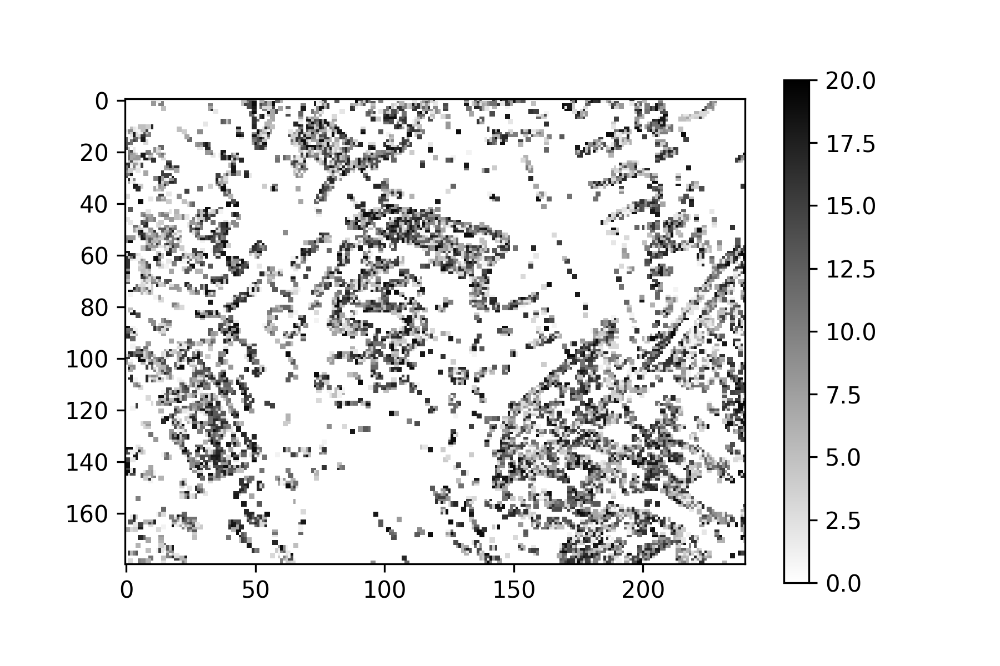

# Stereo Vision based on Event Camera

## Motivation

  
Event based cameras have been proven to have absolute advantages over traditional cameras in data processing.

1. High temporal resolution
2. On-sensor pre-processing
3. Handling of diffcult lighting situations

The only shortcoming is the lack of supported algorithms, but the direct way to solve this shortcoming is to implement applications on this technology. 
Stereo vision is often used to judge the distance between objects, and the advantages of event-based cameras can well cope with various scene needs. 
Therefore, the transition from stereo vision based on traditional cameras to event-based cameras is very natural.

## Introduction
This project is used to reproduce the results published in  
[Kogler, J., Sulzbachner, C., Humenberger, M., Eibensteiner, F.,
Address-Event Based Stereo Vision with Bio-Inspired Silicon Retina Imagers,
Advances in Theory and Applications of Stereo Vision (2011), pp. 165-188.] 
(https://u.pcloud.link/publink/show?code=XZ0QktkZJeG08fzrsT0y587cBu2vpy3EEbk7)

We omit the calibration process of the left and right cameras, because the images we use have already been calibrated.

The project implements the following functions:  

- In the [CameraBuffer](src/CameraBuffer.py) class, the event procedures are being simulated.  
This class includes two methods, one is to prepare data, it puts the collected data into memory.
The other is to find the corresponding event. Both of these two methods have implementations corresponding to two different data structures, 
one is ordinary Array, the other is a dictionary, also called the hashmap.

- In the [Util](src/Util.py) class, loading method and matching costs functions are been implemented.  
The loading method is mainly used to adapt to different formats of data. 
Three common linear and nonlinear methods are provided in the cost calculation method.

- The [OutputController](src/OutputController.py) class is the most important class in the entire project, 
which implements the very important WMI data structure in the event data processing process.  
In addition, some related methods such as refreshing WMI, applying filters, evaluating cost values, etc., are all implemented in this class.

- The data we used were provided by Professor Marianne Maertens and Professor Guillermo Gallego Bonet. 
Please refer to this [link](http://www.psyco.tu-berlin.de/) for details and contact information. 

## Problems found during the implementation

- Due to the limited time, we only implemented the offline algorithm. 
The efficiency of the algorithm for online calculations has yet to be considered. 
The main reason for the inefficiency of the calculation in the offline version is that the event search interval is too large. 
Since we have not limited the size of the cache, simulation During the process, all events are loaded and are taken into consideration. 
This situation does not happen in practice because the cache size is limited.

- The choice of filter. 
At the beginning of the algorithm, because the available data is very small, 
if the filter is applied at this time, it will cause wrong results. 
The solution is that the filter should not be applied to the pixels where no event has occurred.

- The formulation of maximum disparity parameters. During the experiment, 
we found that setting the maximum disparity value incorrectly will lead to very wrong event matching results, 
because our algorithm only penalizes the time difference, but lacks the penalty for the relative distance of the event.
This problem has been improved in [subsequent papers](https://mediatum.ub.tum.de/doc/1254531/131347.pdf).

## Usage
See template.py

## Result
The result of our algorithm is a disparity map, which is shown below. The maximum disparity in the example is 20. 
The detailed results are in the directory "result".
  

## Reference
[Kogler, J., Sulzbachner, C., Humenberger, M., Eibensteiner, F.,
Address-Event Based Stereo Vision with Bio-Inspired Silicon Retina Imagers,
Advances in Theory and Applications of Stereo Vision (2011), pp. 165-188.] 
(https://u.pcloud.link/publink/show?code=XZ0QktkZJeG08fzrsT0y587cBu2vpy3EEbk7)

[Firouzi, M. and Conradt, J.,
Asynchronous Event-based Cooperative Stereo Matching Using Neuromorphic Silicon Retinas,
Neural Processing Letters, 43(2):311-326, Apr. 2016.](https://mediatum.ub.tum.de/doc/1254531/131347.pdf)