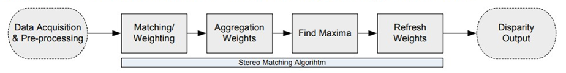

# Stereo Vision based on Event Camera

## Motivation

Event based cameras have been proved to have relative advantages over traditional cameras in the following aspects:

1. High temporal resolution
2. On-sensor pre-processing
3. High Dynamic Range: capable of handling extreme light or dark situations

The only shortcoming is the lack of supported algorithms, and the direct way to solve this shortcoming is to implement applications on this technology. 
Stereo vision is often used to judge the distance between objects and the camera. And the advantages of our event-based cameras can well cope with various scene needs. Therefore, the transition from frame-based stereo algorithm to event-based stereo algorithm is our main task in this project.

## Workflow

* The above figure is taken from our guidance paper, which describes the entire data processing flow. 
The whole process is roughly divided into three parts.The first part is data preprocessing, 
and then calculations are performed for each individual event, and finally a disparity map is generated as the result output.

* The data preprocessing part was omitted in our project, because the data we used has been well corrected.
 But for the first part, we still use two data structures to store events for later testing. 
 
* The data processing process is divided into four parts.

    * First of all, we use the event of the left camera as an opportunity to trigger the calculation. 
For each event of the left camera, we calculate the score of the event in a specific time range and space range in the cache of the right camera.
The score will be stored in a three-dimensional array named WMI, where the third dimension represents different disparity values.

    * After adding the score to WMI, it will be subjected to a specific convolution operation to remove unnecessary noise. 

    * Then for each pixel, find the disparity value with the highest score. 
It is worth noting that this is actually a convolution operation with a maximum filter applied to WMI.

    * Finally, WMI needs to perform a certain attenuation operation. After a period of time, the value in WMI needs to be reduced.

* As the output, we only need to convert the result of the convolution with the maximum filter in the previous step into an image for output. 
It should be noted that the result here is only the disparity value, if the actual distance is needed as the result, 
one more step is needed Calculation. Because this step is trivial, we also omit it.

## Code Structure
This project is used to reproduce the results published in  
[Kogler et al, Address-Event Based Stereo Vision with Bio-Inspired Silicon Retina Imagers,
Advances in Theory and Applications of Stereo Vision (2011), pp. 165-188.](https://u.pcloud.link/publink/show?code=XZ0QktkZJeG08fzrsT0y587cBu2vpy3EEbk7)

We skipped the calibration process, since the images we used were already been calibrated.

The project implements the following functions:  

- In the [CameraBuffer](src/CameraBuffer.py) class, the event procedures are being simulated.  
This class includes two methods, one is to prepare data, it puts the collected data into memory.
The other is to find the corresponding event. Both of these two methods have implementations corresponding to two different data structures, 
one is ordinary Array, the other is a dictionary, also called the hashmap.

- In the [Util](src/Util.py) class, loading method and matching costs functions are been implemented.  
The loading method is mainly used to adapt to different formats of data. 
Three common linear and nonlinear methods are provided in the cost calculation method.

- The [OutputController](src/OutputController.py) class is the most important class in the entire project, 
which implements the very important WMI data structure in the event data processing process.  
In addition, some related methods such as refreshing WMI, applying filters, evaluating cost values, etc., are all implemented in this class.

- The data we used were provided by Professor Marianne Maertens and Professor Guillermo Gallego Bonet. 
Please refer to this [link](http://www.psyco.tu-berlin.de/) for details and contact information. 

## Problems found during the implementation

- Due to the limited time, we only implemented the offline algorithm. 
The efficiency of the algorithm for online calculations has yet to be considered. 
The main reason for the inefficiency of the calculation in the offline version is that the event search interval is too large. 
Since we have not limited the size of the cache, simulation During the process, all events are loaded and are taken into consideration. 
This situation does not happen in practice because the cache size is limited.

- The choice of filter. 
At the beginning of the algorithm, because the available data is very small, 
if the filter is applied at this time, it will cause wrong results. 
The solution is that the filter should not be applied to the pixels where no event has occurred.

- The formulation of maximum disparity parameters. During the experiment, 
we found that setting the maximum disparity value incorrectly will lead to very wrong event matching results, 
because our algorithm only penalizes the time difference, but lacks the penalty for the relative distance of the event.
This problem has been improved in [subsequent papers](https://mediatum.ub.tum.de/doc/1254531/131347.pdf).

## Usage
See [template.py](template.py)

## Result
The result of our algorithm is a disparity map, which is shown below. The maximum disparity in the example is 20. 
The detailed results are in the directory "result".

Video 1: Berlinale simple dataset

Video 2: Sim flying dataset

## Reference
[Kogler et al., Address-Event Based Stereo Vision with Bio-Inspired Silicon Retina Imagers, Advances in Theory and Applications of Stereo Vision (2011), pp. 165-188.]
(https://u.pcloud.link/publink/show?code=XZ0QktkZJeG08fzrsT0y587cBu2vpy3EEbk7)

[Firouzi, M. & Conradt, J., Asynchronous Event-based Cooperative Stereo Matching Using Neuromorphic Silicon Retinas, Neural Processing Letters, 43(2):311-326, Apr. 2016.]
(https://mediatum.ub.tum.de/doc/1254531/131347.pdf)

[Gallego, Guillermo & Lund, Jon & Mueggler, Elias & Rebecq, Henri & Delbruck, Tobi & Scaramuzza, Davide. (2017). Event-based, 6-DOF Camera Tracking from Photometric Depth Maps. IEEE Transactions on Pattern Analysis and Machine Intelligence. PP. 1-1. 10.1109/TPAMI.2017.2769655.] 
(https://www.researchgate.net/figure/An-event-camera-and-its-output_fig2_320847681)